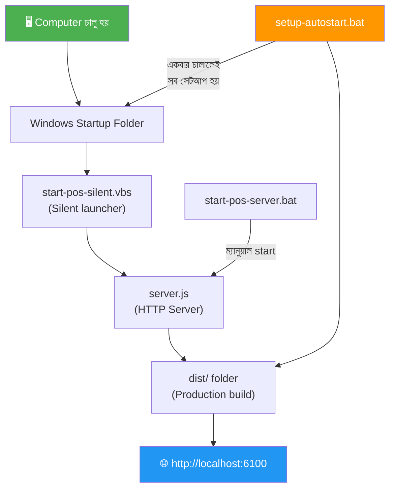
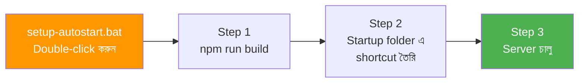
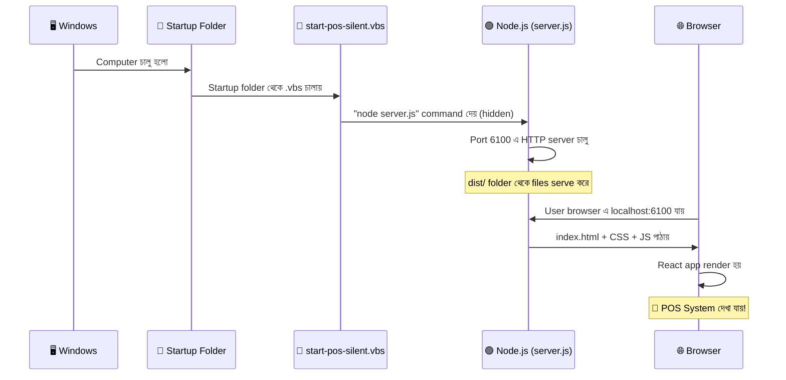

# POS Auto-Start Implementation — সম্পূর্ণ ব্যাখ্যা

## 🎯 সমস্যা কী ছিল?

আপনার POS সিস্টেম চালাতে হলে প্রতিবার terminal ওপেন করে `npm run dev` দিতে হতো। কিন্তু Saudi Arabia-তে POS system গুলো এভাবে কাজ করে:
- Computer চালু → POS **নিজে থেকেই** চালু হয়ে যায়
- Browser এ একটা নির্দিষ্ট address দিলেই POS দেখায়

এটা করতে আমাকে **৩টি সমস্যা** সমাধান করতে হয়েছে:

| # | সমস্যা | সমাধান |
|---|--------|--------|
| 1 | `npm run dev` হলো development mode — ধীর, unstable | Production build করে static file serve করা |
| 2 | কে serve করবে এই files? | একটা lightweight Node.js HTTP server |
| 3 | Computer চালু হলে কীভাবে auto-start হবে? | Windows Startup folder এ script রাখা |

---

## 📁 কোন ফাইলে কী করা হয়েছে

মোট **৪টি নতুন ফাইল** তৈরি এবং **২টি existing ফাইল** পরিবর্তন করা হয়েছে:



---

## 📄 ফাইল ১: `server.js` — মূল HTTP Server

> [!IMPORTANT]
> এটাই সবচেয়ে গুরুত্বপূর্ণ ফাইল। এটা একটা mini web server যেটা আপনার built POS app কে serve করে।

### সম্পূর্ণ কোড ব্যাখ্যা:

[server.js](file:///d:/Jakir-Vai/POS/server.js)

#### Part 1: Dependencies ও Setup (Line 1-8)

```javascript
import http from 'http';          // Node.js built-in — HTTP server তৈরি করে
import fs from 'fs';              // Node.js built-in — File পড়ার জন্য
import path from 'path';          // Node.js built-in — File path handle করার জন্য
import { fileURLToPath } from 'url'; // ES Module এ __dirname পাওয়ার জন্য

const __dirname = path.dirname(fileURLToPath(import.meta.url));
const PORT = 6100;                // যে port এ server চলবে
const DIST_DIR = path.join(__dirname, 'dist'); // Build হওয়া files এর folder
```

**কেন এগুলো দরকার?**
- `http` — Node.js এর built-in module, কোনো npm package install করতে হয় না। এটা দিয়ে web server তৈরি করা যায়
- `fs` — File System module, file পড়তে ব্যবহার হয়
- `path` — Windows এ `\` আর Linux এ `/` ব্যবহার হয়, `path` module এই difference handle করে
- `PORT = 6100` — এটা পরিবর্তন করে আপনি যেকোনো port এ চালাতে পারবেন

> [!WARNING]
> Port **6000** ব্যবহার করবেন না! Chrome, Edge, Firefox সবাই এটা block করে (`ERR_UNSAFE_PORT`)। কারণ port 6000 হলো X11 Window System এর জন্য reserved। Port **6100, 5000, 8080, 3000** — এগুলো safe।

#### Part 2: MIME Types (Line 10-33)

```javascript
const MIME_TYPES = {
  '.html': 'text/html; charset=utf-8',
  '.css': 'text/css; charset=utf-8',
  '.js': 'application/javascript; charset=utf-8',
  '.png': 'image/png',
  '.jpg': 'image/jpeg',
  // ... আরো types
};
```

**এটা কী?**
Browser কে বলে দেওয়া হয় যে ফাইলটি কী ধরনের:
- `.html` → এটা HTML page
- `.css` → এটা stylesheet
- `.js` → এটা JavaScript
- `.png` → এটা image

**কেন দরকার?**
যদি MIME type না বলা হয়, browser বুঝতে পারবে না ফাইলটা কী। CSS file কে text হিসেবে দেখাবে, image load হবে না।

#### Part 3: File Serve Function (Line 35-54)

```javascript
function serveFile(res, filePath) {
  const stat = fs.statSync(filePath);       // ফাইলের size বের করে
  const contentType = getContentType(filePath); // MIME type বের করে

  res.writeHead(200, {                       // HTTP 200 = "সব ঠিক আছে"
    'Content-Type': contentType,             // ফাইলের type
    'Content-Length': stat.size,             // ফাইলের size
    'Cache-Control': filePath.includes('/assets/')
      ? 'public, max-age=31536000, immutable'  // Assets: 1 বছর cache
      : 'no-cache',                            // HTML: cache করবে না
  });

  const stream = fs.createReadStream(filePath); // ফাইল stream এ পড়ে
  stream.pipe(res);                             // browser এ পাঠায়
}
```

**এটা কী করে?**
একটা file পড়ে browser এ পাঠায়। যেমন browser যখন `index.css` চায়, এই function সেটা পড়ে পাঠিয়ে দেয়।

**Cache কেন?**
- `assets/` folder এর files (CSS, JS) — এগুলোর নামে hash থাকে (যেমন `index-CKJqjH3r.css`), তাই ১ বছর cache করলেও সমস্যা নেই। Code পরিবর্তন হলে নতুন hash হবে।
- `index.html` — এটা cache করা যাবে না, কারণ এটাই নতুন assets এর reference ধরে

#### Part 4: Request Handler (Line 56-93)

```javascript
const server = http.createServer((req, res) => {
  let urlPath = decodeURIComponent(req.url.split('?')[0]);

  // Security check — directory traversal attack ঠেকায়
  if (urlPath.includes('..')) {
    res.writeHead(403);
    res.end('Forbidden');
    return;
  }

  let filePath = path.join(DIST_DIR, urlPath);

  // ফাইল থাকলে serve করো
  if (fs.existsSync(filePath) && fs.statSync(filePath).isFile()) {
    serveFile(res, filePath);
    return;
  }

  // SPA fallback — ফাইল না থাকলে index.html দাও
  const indexPath = path.join(DIST_DIR, 'index.html');
  if (fs.existsSync(indexPath)) {
    serveFile(res, indexPath);
    return;
  }
});
```

**এটাই server এর মস্তিষ্ক:**

1. Browser request পাঠায়: `GET /assets/index.css`
2. Server দেখে: `dist/assets/index.css` ফাইলটা আছে কি না
3. থাকলে: পাঠিয়ে দেয়
4. না থাকলে: `index.html` পাঠায় (কারণ React SPA তে routing browser এ হয়)

**SPA Fallback কেন দরকার?**
আপনার POS এ যখন `/sales` বা `/purchase` page এ যান, আসলে কোনো `sales.html` ফাইল নেই। React Router browser এ URL দেখে ঠিক component দেখায়। তাই সব unmatched route এ `index.html` দিতে হয়।

#### Part 5: Server Start (Line 95-113)

```javascript
server.listen(PORT, '0.0.0.0', () => {
  console.log(`✅ POS Server is running at http://localhost:${PORT}`);
});
```

- `0.0.0.0` মানে সব network interface এ listen করবে (localhost + LAN IP)
- এতে আপনি অন্য device থেকেও access করতে পারবেন

---

## 📄 ফাইল ২: `start-pos-silent.vbs` — Silent Launcher

[start-pos-silent.vbs](file:///d:/Jakir-Vai/POS/start-pos-silent.vbs)

```vbscript
Set WshShell = CreateObject("WScript.Shell")
WshShell.CurrentDirectory = "d:\Jakir-Vai\POS"
WshShell.Run "cmd /c node server.js", 0, False
```

**এটা কী?**
VBScript — Windows এর built-in scripting language।

**কেন `.bat` না ব্যবহার করে `.vbs` ব্যবহার করা হলো?**

| Feature | `.bat` (Batch) | `.vbs` (VBScript) |
|---------|---------------|-------------------|
| Console window | ✅ দেখায় (কালো window) | ❌ দেখায় না |
| Background এ চলে | ❌ না | ✅ হ্যাঁ |
| Auto-start এর জন্য | ❌ বিরক্তিকর | ✅ Perfect |

**Line by line:**
1. `CreateObject("WScript.Shell")` — Windows Shell object তৈরি করে
2. `CurrentDirectory = "d:\Jakir-Vai\POS"` — কোন folder থেকে command চালাবে সেটা সেট করে
3. `WshShell.Run "cmd /c node server.js", 0, False`:
   - `cmd /c node server.js` — এই command চালায়
   - `0` — **window লুকায়** (0 = hidden, 1 = normal)
   - `False` — command শেষ হওয়ার জন্য wait করে না

> [!TIP]
> **নতুন প্রজেক্টে ব্যবহার করতে** শুধু `CurrentDirectory` path আর command পরিবর্তন করুন।

---

## 📄 ফাইল ৩: `start-pos-server.bat` — Manual Launcher

[start-pos-server.bat](file:///d:/Jakir-Vai/POS/start-pos-server.bat)

```batch
@echo off
cd /d "d:\Jakir-Vai\POS"

:: Node.js আছে কিনা check
where node >nul 2>nul
if %errorlevel% neq 0 (
    echo Node.js is not installed
    pause
    exit /b 1
)

:: dist folder নেই? Build করো
if not exist "dist\index.html" (
    echo Building POS application...
    call npm run build
)

:: Server চালু করো
node server.js
```

**এটা কখন ব্যবহার হবে?**
- আপনি manually server চালু করতে চাইলে double-click করবেন
- এটাতে console window দেখায় — তাই error দেখতে পারবেন
- Auto-start এর জন্য এটা না, ওটার জন্য `.vbs` file

**Smart features:**
- Node.js installed আছে কিনা check করে
- `dist/` folder না থাকলে automatically build করে

---

## 📄 ফাইল ৪: `setup-autostart.bat` — One-Click Setup

[setup-autostart.bat](file:///d:/Jakir-Vai/POS/setup-autostart.bat)

**এটা সবচেয়ে important — একবার চালালেই সব সেটআপ হয়ে যায়:**



**Step 2 এর বিস্তারিত — Windows Startup এ কীভাবে যোগ হয়:**

```batch
set "STARTUP_FOLDER=%APPDATA%\Microsoft\Windows\Start Menu\Programs\Startup"
```

Windows এ একটা special folder আছে:
```
C:\Users\<আপনার নাম>\AppData\Roaming\Microsoft\Windows\Start Menu\Programs\Startup
```

এই folder এ যেকোনো `.exe`, `.bat`, `.vbs`, বা `.lnk` (shortcut) রাখলে **Windows চালু হলেই সেটা automatically চালু হয়**।

Setup script এই কাজটা করে:
```batch
powershell -Command "$ws = New-Object -ComObject WScript.Shell; 
  $s = $ws.CreateShortcut('%SHORTCUT_PATH%'); 
  $s.TargetPath = '%VBS_SOURCE%'; 
  $s.Save()"
```

এটা PowerShell ব্যবহার করে `start-pos-silent.vbs` এর একটা shortcut (.lnk) তৈরি করে Startup folder এ রাখে।

---

## 📄 পরিবর্তিত ফাইল: `vite.config.js`

[vite.config.js](file:///d:/Jakir-Vai/POS/vite.config.js)

```diff
 server: {
     host: "::",
-    port: 8080,
+    port: 6100,
```

**কেন পরিবর্তন?**
Development mode (`npm run dev`) এও যেন একই port 6100 এ চলে — confusion এড়ানোর জন্য।

---

## 📄 পরিবর্তিত ফাইল: `package.json`

[package.json](file:///d:/Jakir-Vai/POS/package.json)

```diff
 "preview": "vite preview",
-"test": "vitest run",
-"test:watch": "vitest"
+"serve": "node server.js",
+"setup": "npm run build && node server.js"
```

**নতুন commands:**
- `npm run serve` — শুধু server চালু করে (build আগে থেকে থাকলে)
- `npm run setup` — আগে build করে, তারপর server চালু করে

---

## 🔄 পুরো Flow — Computer চালু থেকে POS দেখা পর্যন্ত



---

## 🆕 নতুন প্রজেক্টে কীভাবে করবেন — Step by Step

### Prerequisites:
- Node.js installed থাকতে হবে
- Project টি Vite/React based হতে হবে (অথবা যেকোনো project যেটা `dist/` folder এ build হয়)

### Step 1: `server.js` তৈরি করুন

Project root এ `server.js` ফাইল তৈরি করুন। উপরের কোড copy করুন। শুধু **২টা জিনিস** পরিবর্তন করুন:

```javascript
const PORT = 6100;  // আপনার পছন্দের port
const DIST_DIR = path.join(__dirname, 'dist'); // build folder এর নাম
```

> [!NOTE]
> যদি আপনার project Next.js হয়, তাহলে `DIST_DIR` হবে `'out'` অথবা `'.next'`। Create React App এর জন্য `'build'`। Vite এর জন্য `'dist'`।

### Step 2: `start-pos-silent.vbs` তৈরি করুন

```vbscript
Set WshShell = CreateObject("WScript.Shell")
WshShell.CurrentDirectory = "D:\YOUR\PROJECT\PATH"   ' <-- এটা পরিবর্তন করুন
WshShell.Run "cmd /c node server.js", 0, False
Set WshShell = Nothing
```

### Step 3: Production Build করুন

```bash
npm run build
```

### Step 4: Test করুন

```bash
node server.js
```
Browser এ `http://localhost:6100` যান — কাজ করলে পরবর্তী step।

### Step 5: Windows Startup এ যোগ করুন

**ম্যানুয়াল উপায়:**
1. `Win + R` চাপুন
2. টাইপ করুন: `shell:startup`
3. Enter দিন — Startup folder খুলবে
4. আপনার `start-pos-silent.vbs` ফাইলের shortcut এখানে paste করুন

**অথবা** `setup-autostart.bat` ব্যবহার করুন (উপরে যেটা তৈরি করেছি)।

### Step 6: Computer Restart করে verify করুন

Restart দিন → Browser এ `http://localhost:6100` যান → POS দেখা যাচ্ছে!

---

## ❓ FAQ — সাধারণ প্রশ্ন

### ❓ Code পরিবর্তন করলে কী করতে হবে?
```bash
npm run build    # নতুন build তৈরি করুন
```
Server restart দিতে হবে না — পরবর্তী request এ নতুন files serve হবে। তবে server চালু থাকলে restart দিলে ভালো।

### ❓ Server বন্ধ করতে চাইলে?
Task Manager → "node.exe" খুঁজুন → End Task

### ❓ Port পরিবর্তন করতে চাইলে?
`server.js` এ `PORT` পরিবর্তন করুন + `vite.config.js` এও dev port পরিবর্তন করুন।

### ❓ `npm run dev` vs `node server.js` — পার্থক্য কী?

| Feature | `npm run dev` | `node server.js` |
|---------|--------------|-------------------|
| Mode | Development | Production |
| Speed | ধীর (HMR, compilation) | দ্রুত (static files) |
| Hot Reload | ✅ আছে | ❌ নেই |
| Error overlay | ✅ আছে | ❌ নেই |
| Production ready | ❌ না | ✅ হ্যাঁ |
| Resources ব্যবহার | বেশি | কম |
| কখন ব্যবহার | Code লেখার সময় | Deploy/Production এ |

### ❓ অন্য device থেকে access করতে চাইলে?
Server `0.0.0.0` তে listen করে, তাই LAN এর অন্য device থেকে আপনার computer এর IP ব্যবহার করে access করা যাবে:
```
http://192.168.1.XXX:6100
```
(আপনার IP জানতে: `ipconfig` command দিন)
